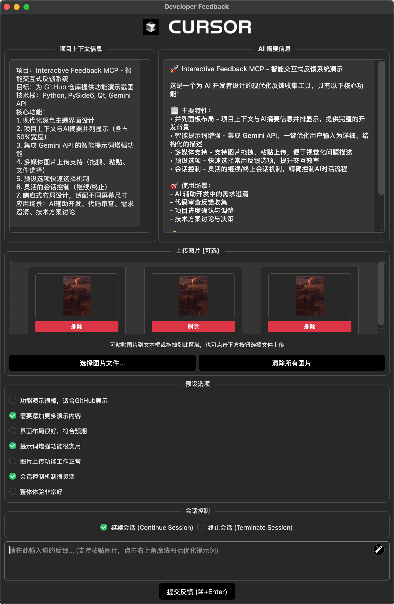

# 🗣️ Interactive Feedback Magic
[](LICENSE)
[](https://python.org)
[](https://modelcontextprotocol.io/)

基于 [Fábio Ferreira](https://x.com/fabiomlferreira) 和 [Pau Oliva](https://x.com/pof) 开发的优秀项目 [interactive-feedback-mcp](https://github.com/poliva/interactive-feedback-mcp)，在原有功能基础上做了一些微小的改进。这是一个 [MCP 服务器](https://modelcontextprotocol.io/)，为 AI 辅助开发工具（如 [Cursor](https://www.cursor.com)、[Cline](https://cline.bot) 和 [Windsurf](https://windsurf.com)）提供人机交互反馈功能。

## ✨ 主要特性

### 核心功能
- **🔄 交互式反馈**：通过图形界面与 AI 助手进行实时对话
- **📝 预设选项**：支持快速选择预定义的回复选项
- **🎨 用户界面**：基于 PySide6 的图形界面
### 改进功能
- **🖼️ 多图片支持增强**：
  - 可选择图片文件上传
  - 从剪贴板拷贝图像
  - 支持传入多张图片
  - 图片可逐张单独删除
  - 所有图片可一键全部清除
- **📋 双复制按钮功能**：
  - 项目上下文信息一键复制
  - AI 摘要内容一键复制
  - 统一的布局设计和交互体验
  - 完整内容复制，保留所有格式
- **🎨 UI 体验优化**：
  - 优化列表选项选中时，高亮背景调整为中海绿
  - 修复 windows 下无法显示碳灰背景
  - 拖动文件自动识别并增加标签强调，模型更容易查找指向文件
  - 统一面板布局，标题位置调整到方框内部
- **⚡ 优化提示词**：集成 Google Gemini API，辅助优化提示词表达
- **🎮 会话控制**：灵活控制对话流程，选择继续或结束当前会话
- **🌍 上下文支持**：增加了项目上下文信息的传递功能
- **🔒 安全优化**：API 密钥通过环境变量管理

## 🎬 使用演示



## 📦 安装指南

### 前置要求
- **Python 3.11+**
- **[uv](https://github.com/astral-sh/uv)** 包管理器

### 安装 uv
```bash
# Windows
pip install uv

# Linux
curl -LsSf https://astral.sh/uv/install.sh | sh

# macOS
brew install uv
```

### 获取代码
```bash
git clone https://github.com/airsulG/interactive-feedback-magic.git
cd interactive-feedback-magic
```

## ⚙️ 配置指南

### 基础配置（无提示词增强）
在你的 `claude_desktop_config.json`（Claude Desktop）或 `mcp.json`（Cursor）中添加：
**记住将 `/path/to/interactive-feedback-magic` 路径更改为你在系统上克隆仓库的实际路径。**

```json
{
  "mcpServers": {
    "interactive-feedback": {
      "command": "uv",
      "args": [
        "--directory",
        "/path/to/interactive-feedback-magic",
        "run",
        "server.py"
      ],
      "timeout": 600,
      "autoApprove": [
        "interactive_feedback"
      ]
    }
  }
}
```

### 完整配置（包含提示词增强）
如果你想使用提示词增强功能，需要提供 Gemini API 密钥：

```json
{
  "mcpServers": {
    "interactive-feedback": {
      "command": "uv",
      "args": [
        "--directory",
        "/path/to/interactive-feedback-magic",
        "run",
        "server.py"
      ],
      "env": {
        "GEMINI_API_KEY": "your-gemini-api-key-here"
      },
      "timeout": 600,
      "autoApprove": [
        "interactive_feedback"
      ]
    }
  }
}
```

### 获取 Gemini API 密钥
1. 访问 [Google AI Studio](https://aistudio.google.com/app/apikey)
2. 使用 Google 账户登录
3. 创建新的 API 密钥
4. 将 `"your-gemini-api-key-here"` 替换为你的实际 API 密钥

## 🎯 使用方法

### AI 助手规则配置
在你的 AI 助手中添加以下自定义规则（Cursor 设置 > 规则 > 用户规则）：

## Interactive Feedback 使用规则

- 如果认为用户的指令、需求或目标不够清晰、存在歧义，或者缺少必要信息，你应该使用 `interactive_feedback` 工具向用户提问以澄清，而不是基于自己的猜测继续执行。

- 当有多个合理的执行路径或用户可能需要做选择时，你应该通过 `interactive_feedback` 的 `predefined_options` 参数提供预定义的选项，方便用户快速决策。

- 在任何会话输出的结尾，**始终**使用 `interactive_feedback` MCP 工具等待用户反馈；只有当用户没有提供反馈（空反馈）或者明确要求结束会话，才结束请求。

- **重要**：主动调用一次 `interactive_feedback` 来征求用户对整体结果的最终确认或反馈，通过 `interactive_feedback` 工具等待用户的最终确认或反馈，而不是直接结束会话。

- 当你调用 `interactive_feedback` 工具时，用户将通过工具输出中的 `session_control` 字段指定会话是应该继续还是终止：
  - 如果 `session_control` 的值为 `"continue"`，在处理完当前反馈并完成任何相关的子任务后，你应该再次调用 `interactive_feedback` 工具，以向用户询问进一步的澄清或下一步操作。你可以提示用户，例如"我已经根据你的反馈完成了 X。接下来你想做什么？"或者提出一个更具体的后续问题。
  - 如果 `session_control` 的值为 `"terminate"`，在处理完当前反馈并完成任何相关的子任务后，你应该认为本次特定的澄清循环交互已经完成，并继续最终完成用户的整体请求。除非后续出现全新的不明确之处，否则在此循环中不要再次调用 `interactive_feedback`，然后给予用户鼓励并自然地结束会话。

## 📝 更新日志

### v0.2.2 (2025年6月9日)
🎉 **功能更新 - 统一布局和双复制按钮功能**

#### 📋 双复制按钮功能
- ✨ **项目上下文复制**：左侧面板一键复制完整的项目上下文信息
- 📄 **AI 摘要复制**：右侧面板一键复制完整的 AI 摘要内容
- 🎯 **完整内容复制**：保留原始格式，无过滤处理
- 💬 **用户反馈**：复制成功/失败的明确提示信息

#### 🎨 布局统一化
- 🏗️ **统一设计**：两个面板采用完全相同的布局结构
- 📍 **标题位置调整**：将标题从方框顶部移到内部，提升视觉效果
- 🎭 **自定义标题栏**：使用 QHBoxLayout 容纳标题和复制按钮
- 🔄 **一致体验**：统一的按钮样式、图标和交互效果

### v0.2.1 (2025年6月8日)
🎉 **功能更新 - 多媒体支持增强**

#### 🖼️ 图片功能升级
- ✨ **多图片上传**：支持同时上传和管理多张图片
- 📁 **文件选择器**：通过文件对话框选择本地图片文件
- 📋 **剪贴板支持**：直接粘贴剪贴板中的图像内容
- 🗑️ **灵活管理**：支持单张图片删除和全部清除
- 🎯 **格式支持**：PNG、JPG、JPEG、BMP、GIF 等主流格式

#### 🎨 用户体验优化
- 🌟 **选项高亮**：列表选项选中时显示高亮背景，提升视觉反馈
- 📂 **智能文件识别**：拖拽文件时自动识别并添加醒目标签
- 🤖 **AI 友好**：文件路径格式化，让 AI 更容易理解和定位文件

#### 🔧 技术改进
- 🏗️ **架构优化**：改进图片处理流程，提升性能和稳定性
- 🎭 **UI 增强**：深色主题适配，现代化界面设计
- 📱 **响应式布局**：适配不同屏幕尺寸，提供一致的使用体验

## 🔧 开发指南

### 项目结构
```
interactive-feedback-magic/
├── server.py              # MCP 服务器主文件
├── feedback_ui.py          # 图形用户界面
├── prompt_enhancer.py      # 提示词增强服务
├── ui_styles.py           # UI 样式定义
├── session_control.py     # 会话控制组件
├── prompt_enhancement_widget.py # 提示词增强组件
├── README_CN.md           # 中文文档
├── CHANGES.md             # 变更说明
└── assets/                # 资源文件
    ├── magic.svg          # 魔法图标
    └── 复制.svg           # 复制图标
```

### 本地开发
```bash
# 安装依赖
uv sync

# 运行服务器
python server.py

# 测试 UI
python feedback_ui.py --prompt "测试消息"
```

## 🤝 贡献指南

我们欢迎社区贡献！请遵循以下步骤：

1. Fork 本仓库
2. 创建特性分支 (`git checkout -b feature/amazing-feature`)
3. 提交更改 (`git commit -m 'Add amazing feature'`)
4. 推送到分支 (`git push origin feature/amazing-feature`)
5. 创建 Pull Request

## 📄 开源协议

本项目基于 [Apache 2.0 协议](LICENSE) 开源。

## 🙏 致谢

特别感谢原作者的优秀工作：
- **原始项目**：[interactive-feedback-mcp](https://github.com/poliva/interactive-feedback-mcp) by [Fábio Ferreira](https://x.com/fabiomlferreira) 和 [Pau Oliva](https://x.com/pof)
- **灵感来源**：Tommy Tong 的 [interactive-mcp](https://github.com/ttommyth/interactive-mcp)
- **技术支持**：[Model Context Protocol](https://modelcontextprotocol.io/) 社区